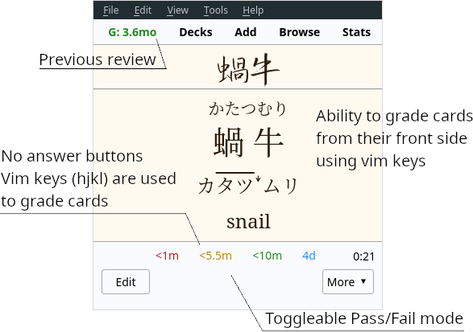

# AJT Flexible Grading

[](https://ankiweb.net/shared/info/1715096333)
[](https://tatsumoto-ren.github.io/blog/join-our-community.html)
[](https://t.me/ajatt_tools)
[](https://www.patreon.com/bePatron?u=43555128)


> Bring keyboard-driven reviewing to Anki 2.1.

<p align="center">
  
</p>

Ajatt-Tools Flexible Grading for Anki 2.1 significantly overhauls the reviewing process.
It puts keyboard first and allows you to go through your reps by pressing `hjkl`
while having your hands lay naturally on the home row of the keyboard.
It goes further by removing review buttons and letting you grade your cards from the question side.

## Features

* Vim bindings. Put mouse away when doing your reviews.
  * `h` - Fail
  * `j` - Hard
  * `k` - Good
  * `l` - Easy
  * `u` - Undo
* Flexible grading.
  Grade cards from their front side.
  Save yourself a few extra keypresses if you know that you know the answer.
* Color coding for answers. Default colors:
  * `Fail` - Red
  * `Hard` - Orange
  * `Good` - Green
  * `Easy` - Blue
* Remove answer buttons. Possible options:
  * `Hide`. Completely remove answer buttons (enabled by default).
  * `Disable`. Disabled buttons are unusable and un-clickable.
* Toggleable Pass-Fail mode.
  Removes `Hard` and `Easy` buttons and keybindings.
  Make decisions easier by having to choose
  whether you know a card or not instead of how well you know it.
  Avoid being stuck in
  [Ease Hell](https://youtu.be/1XaJjbCSXT0?t=665)
  by using this feature in combination with the recommended
  [Options Groups settings](https://tatsumoto-ren.github.io/blog/setting-up-anki.html#options-groups).
* Last grade is shown on the toolbar.
  It is possible to click on it and bring up the Anki browser with the card selected.
* Consistent key mappings for the `1234` keys.
  `2`, `3` and `4` always grade `Hard`, `Good` and `Easy` respectively.
  Only relevant for the V1 scheduler.
  V2 scheduler does this out of the box.
* Zoom shortcuts.
  Adds zoom shortcuts that aren't present in vanilla Anki.
  To zoom in, press `Ctrl+Plus`. To zoom out, press `Ctrl+Minus`.
  The add-on can remember previous zoom levels and restore them when Anki changes state.
* An option to turn off the indicator that tells you whether a card is `new`, `review`, or `learn`.
* An option to press any answer key to flip the card while the card is in `question` state.
  This means that users can easily flip a card and rate it "good" by pressing `kk`.

<p align="center">
  
</p>
<p align="center"><i>Flexible Grading with answer buttons enabled.</i></p>

## Installation

Install from [AnkiWeb](https://ankiweb.net/shared/info/1715096333), or manually with `git`:

```
$ git clone 'https://github.com/Ajatt-Tools/FlexibleGrading.git' ~/.local/share/Anki2/addons21/FlexibleGrading
```

Make sure to disable other addons that may affect answer buttons or shortcuts, for example:
* [Pass/Fail](https://web.archive.org/web/https://massimmersionapproach.com/table-of-contents/anki/low-key-anki/low-key-anki-pass-fail/)
* [Vim Answer Shortcuts](https://ankiweb.net/shared/info/1197299782)
* [Button Colours](https://ankiweb.net/shared/info/2494384865)
* [Large and Colorful Buttons](https://ankiweb.net/shared/info/1829090218)
* [Bigger Show All Answer Buttons](https://ankiweb.net/shared/info/2034935033)

## Usage

Keep your fingers on home row keys.
The following fingers are used:

* Thumbs - Reveal answer, grade `Good`.
* Right hand:
  * `Index` - Again, Hard, Undo.
  * `Middle` - Good.
  * `Ring` - Easy.

<p align="center">
  
</p>

## Configuration

To configure the add-on select `Tools` > `AJT Flexible Grading Options...`.

The most optimal settings come out of the box:

* Answer buttons are hidden forcing you to use the vim keys.
* Flexible grading and Pass-Fail are enabled.

## Our community

Join our
[Matrix room](https://tatsumoto-ren.github.io/blog/join-our-community.html)
to learn Japanese, discuss Ajatt-Tools projects, ask questions and make friends.

If you enjoy this add-on, please consider supporting my work by
pledging your support on [Patreon](https://www.patreon.com/bePatron?u=43555128).
Thank you so much!
